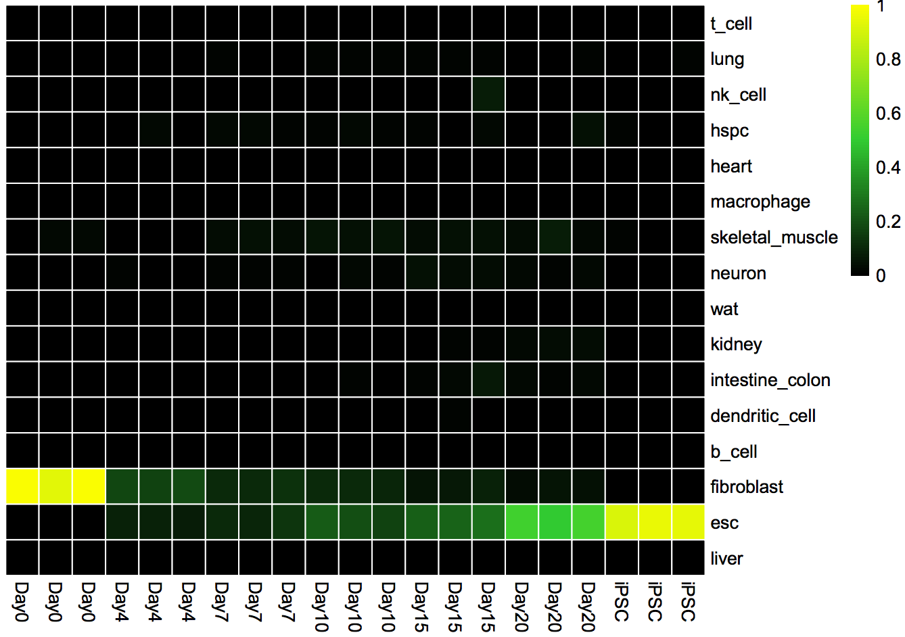
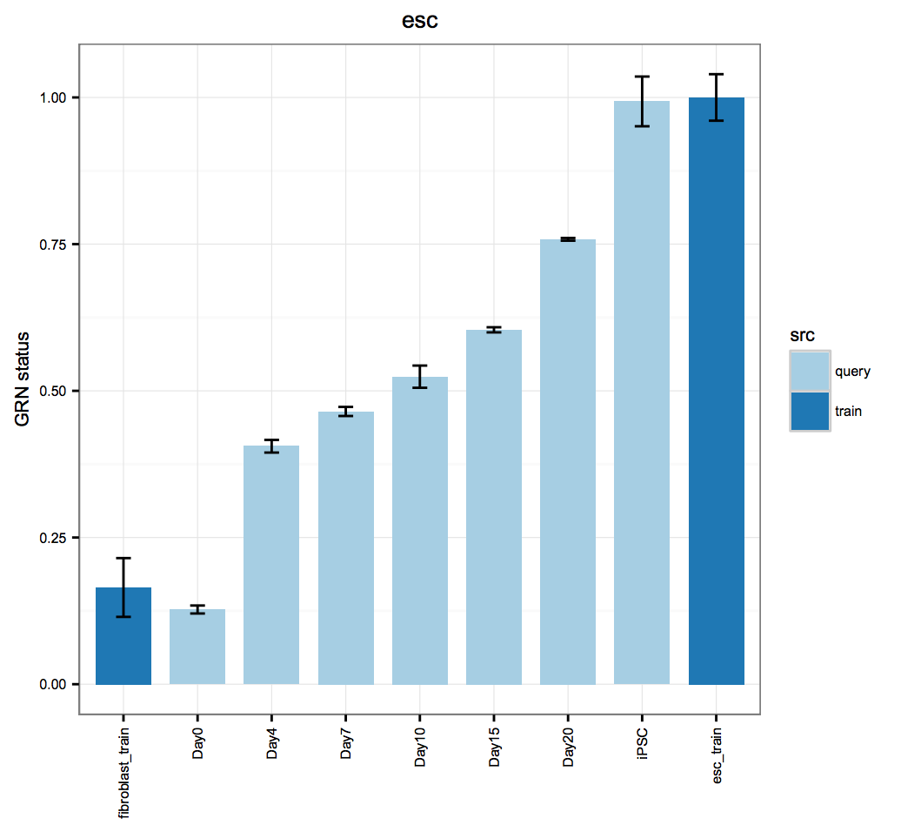
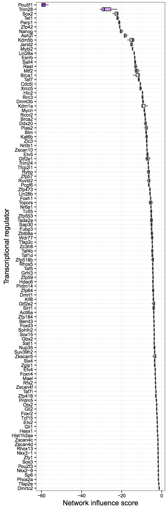
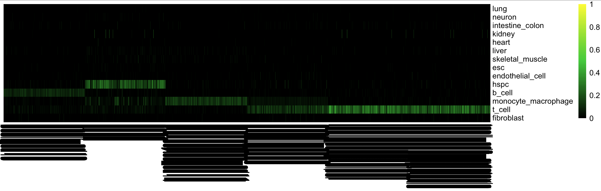
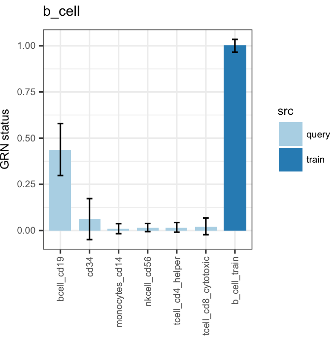
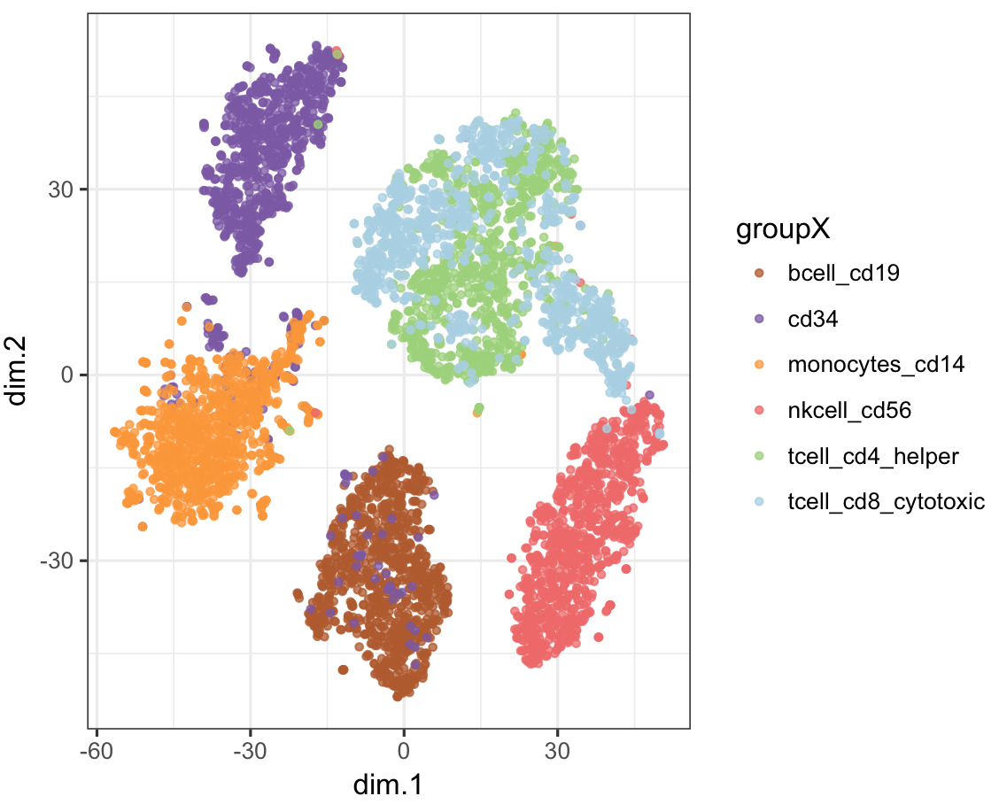
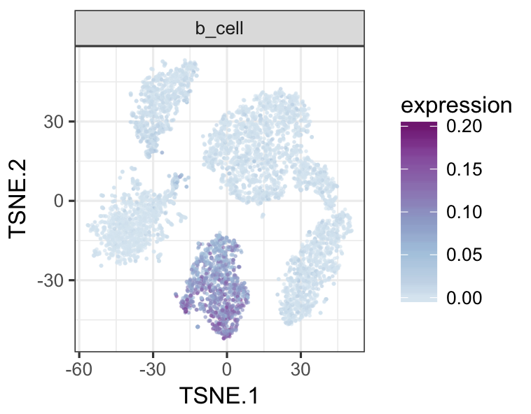
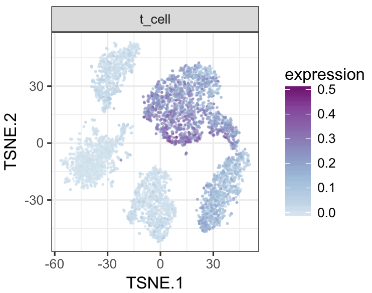
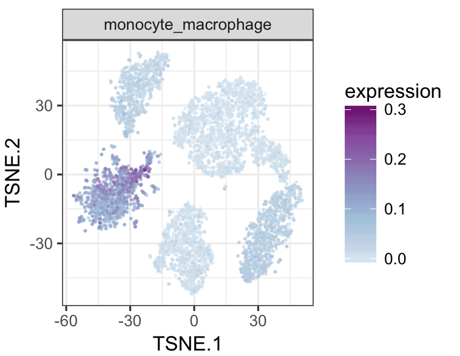
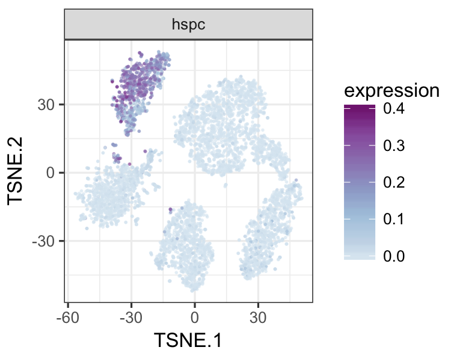

# CellNet


Shortcut to [bulk rna-se protocol](#bulk_protocol)

Shortcut to [single cell protocol](#sc_protocol)


### Introduction
CellNet is a network-biology-based, computational platform that assesses the fidelity of cellular engineering and generates hypotheses for improving cell derivations. CellNet is based on the reconstruction of cell type-specific gene regulatory networks (GRNs), which we performed using publicly available **RNA-Seq** data of 16 mouse and 16 human cell and tissue types. For now, there are two ways to run CellNet for RNA-Seq data. You can run it as a command line tool on the cloud through Amazon Web Services (**recommended**), or you can run it locally (**not recommended**). Here we provide a 'bare-bones' walk-thru of how to apply CellNet to your RNA-Seq data. 

## Ways to Run CellNet
#### Running CellNet in the Cloud
The public CellNet Amazon Machine Image (AMI), available on Amazon Web Services (AWS), has all of the prerequisite software and libraries pre-installed. Because of this and the scalable computing capacity of AWS, **we highly recommend that you use AWS to run CellNet for RNA-Seq data** instead of running it locally. If you are unfamiliar with AWS or cloud computing in general, we recommend the following links for further information:
* [Cloud Computing concepts](http://docs.aws.amazon.com/AWSEC2/latest/UserGuide/concepts.html)
* [Amazon's Elastic Compute Cloud (EC2)](http://docs.aws.amazon.com/AWSEC2/latest/UserGuide/get-set-up-for-amazon-ec2.html)
* [Amazon Machine Images](http://docs.aws.amazon.com/AWSEC2/latest/UserGuide/AMIs.html)
* [Amazon's Simple Storage Service (S3)](http://docs.aws.amazon.com/AWSEC2/latest/UserGuide/AmazonS3.html)

 The CellNet AMI (_CellNet_ ami-62065e75) is available in the AWS US East 1 region (N. Virginia region). Running CellNet on AWS requires uploading your raw data (in the form of .fastq files) either directly to your running instance on AWS EC2, or to S3 and then to your instance. To learn about transferring your fastq files directly to your instance, see [Transferring files to Linux machines using SCP](http://docs.aws.amazon.com/AWSEC2/latest/UserGuide/AccessingInstancesLinux.html). **Note that Amazon charges by the hour for compute resources ($1.68/hour for a c3.8xlarge EC2 instance type)**. On average, it takes up to 2 hours to run a complete CellNet analysis for 144GB of raw data (9 samples of 16GB each).

#### Running CellNet Locally
Alternatively, you can run CellNet locally. The steps to do this are covered in our protocol. 
You will need to install the following command line software:
* [Cutadapt](http://cutadapt.readthedocs.io/en/stable/guide.html) 
* [Salmon](https://combine-lab.github.io/salmon/)
* [GNU Parallel](https://www.gnu.org/software/parallel/)
          
If you are using Mac OS, this can be done easily with PIP and Homebrew.

#### The CellNet RNA-Seq Web Application
* Available soon through AWS!

## Running the Protocol

#### Trained CellNet Objects (*cnProc*)
>At the heart of CellNet is the [Random Forest Classifier](https://en.wikipedia.org/wiki/Random_forest). This is the algorithm that will classify the results of a cell fate experiment. To analyze your own expression data with CellNet, you need a trained CellNet classifier object, which we refer to as a **cnProc** (CellNet Processor). You can select and use the appropriate cnProc that we have generated from the list below. You can also make your own using the code we provide [here](). This is useful if you want to add more cell types, or if you want to train up a cnProc for a different species. **Note: generating a human cnProc requires a lot of computing power.** In general, it should be generated using an EC2 instance - it is probably not a good idea to try performing this locally.

The main ingredients of a cnProc are:
* An R matrix giving the expression levels of a number of genes across all the samples used to train CellNet
* An R dataframe providing metadata on the samples in the expression data matrix (things like cell-type, alignment metrics, SRA accession numbers...)

| SPECIES | DATE | CELL & TISSUE TYPES(# of profiles) | cnProc | raw training data |
|---------|------|------------------------------------|--------|-------------------|
| HS | Oct_25_2016 | b_cell (83), dendritic_cell (75), endothelial_cell (53), esc (52), fibroblast (79), heart (30), hspc (27), intestine_colon (64), kidney (29), liver (33), lung (95), macrophage (254), monocyte (207), neuron (109), skeletal_muscle (189), t_cell (53) | [Download](https://s3.amazonaws.com/cellnet-rnaseq/ref/cnproc/HS/cnProc_RS_hs_Oct_25_2016.rda) | |
| Mouse | Oct_24_2016 | b_cell (193), dendritic_cell (134), esc (134), fibroblast (182), heart (189), hspc (75), intestine_colon (149), kidney (109), liver (265), lung (116), macrophage (176), neuron (188), nk_cell (53), skeletal_muscle (130), t_cell (87), wat (64) | [Download](https://s3.amazonaws.com/cellnet-rnaseq/ref/cnproc/MM/cnProc_MM_RS_Oct_24_2016.rda) | [Download](https://s3.amazonaws.com/cellnet-rnaseq/ref/cnproc/MM/expTrain_MM_rawcounts_Dec_29_16.rda) | 
| Human | Apr_05_2017 | b_cell (83), dendritic_cell (55), endothelial_cell (51), esc (52), fibroblast (46), heart (60), hspc (192), intestine_colon (85), kidney (62), liver (107), lung (94), monocyte_macrophage (206), neuron (90), skeletal_muscle (187), t_cell (43) | [Download](https://s3.amazonaws.com/cellnet-rnaseq/ref/cnproc/HS/cnProc_HS_RS_Apr_05_2017.rda) | |
| Human | Jun_20_2017 | | [Download](https://s3.amazonaws.com/cellnet-rnaseq/ref/cnproc/HS/cnProc_HS_RS_Jun_20_2017.rda) |  [Download](https://s3.amazonaws.com/cellnet-rnaseq/ref/cnproc/HS/expTrain_HS_rawcounts_8_31_2017.rda) |


#### Example Data

These are some datasets you can use to test-drive applying CellNet to RNA-Seq data:

| SPECIES | DATE | SRA ID | DESCRIPTION | METADATA | EXPRESSION |
|---------|------|--------|-------------|----------|------------|
| Human   | Oct 30, 2015 | SRP043684 | Engineered Neurons | [metadata](https://s3.amazonaws.com/cellnet-rnaseq/ref/examples/st_SRP043684_example.rda) | [expression data](https://s3.amazonaws.com/cellnet-rnaseq/ref/examples/expList_SRP043684_example.rda) |
| Mouse | Mar 15, 2016 | SRP059670 | Reprogramming to Pluripotency | [metadata](https://s3.amazonaws.com/cellnet-rnaseq/ref/examples/st_SRP059670_example.rda) | [expression data](https://s3.amazonaws.com/cellnet-rnaseq/ref/examples/expList_SRP059670_example.rda) |

#### Salmon Index Table

If you are running CellNet locally, you will need to have salmon installed on your machine. Below are a few indexes that we have created from our transcriptome and know to work.

| SPECIES | SALMON | INDEX DOWNLOAD | NOTE/USAGE |
|---------|----------------|----------------|------------|
| Human | 0.6.0 | [salmon.index.human.050316.tgz](https://s3.amazonaws.com/cellnet-rnaseq/ref/salmon.index.human.050316.tgz) | Default for AWS workflow |
| Mouse | 0.6.0 | [salmon.index.mouse.050316.tgz](https://s3.amazonaws.com/cellnet-rnaseq/ref/salmon.index.mouse.050316.tgz) | Default for AWS workflow |
| Human | 0.7.3 | [salmon.index.human.122116.tgz](https://s3.amazonaws.com/cellnet-rnaseq/ref/salmon.index.human.122116.tgz) | Protocol for local** |
| Mouse | 0.7.3 | [salmon.index.mouse.122116.tgz](https://s3.amazonaws.com/cellnet-rnaseq/ref/salmon.index.mouse.122116.tgz) | Protocol for local** |
| Human | 0.8.2 | [salmon.index.human.052617.tgz](https://s3.amazonaws.com/cellnet-rnaseq/ref/salmon.index.human.052617.tgz) | Uses latest version of Salmon to date |
| Mouse | 0.8.2 | [salmon.index.mouse.052617.tgz](https://s3.amazonaws.com/cellnet-rnaseq/ref/salmon.index.mouse.122116.tgz) | Uses latest version of Salmon to date |

** Here's the [binary Salmon-0.7.3 Mac OSX link](https://github.com/COMBINE-lab/salmon/files/581546/Salmon-0.7.3-pre_OSX_10.11.tar.gz). Salmon-0.8.2 is a stable update and will work for either MacOSX or Linux.

#### <a name="bulk_protocol">A Simplified Protocol</a>

This is a general overview of the commands that can be used to pre-process (pseudoalign and quantify) and apply CellNet to your expression data. The example below works for data from mouse samples.

Pre-processing:

```R
    install_github("pcahan1/CellNet", ref="rpackage")
    cn_setup()
    library(CellNet)
    fetch_salmon_indices(species="mouse")
    stQuery = read.csv("sampTabFileName.csv")
    expList = cn_salmon(stQuery) ## Assumes your fastq files are in the working directory!
```
    
Applying CellNet:
```R
    download.file("https://s3.amazonaws.com/CellNet/rna_seq/mouse/cnProc_MM_RS_Oct_24_2016.rda", dest="./cnProc_MM_RS_Oct_24_2016.rda")
    cnProc = utils_loadObject("cnProc_MM_RS_Oct_24_2016.rda")
    cnRes = cn_apply(expList[['normalized']], stQuery, cnProc)
```
#### Interpreting Output
CellNet produces a number of outputs, the most important being the cnRes Object (CellNet Result). There are three figures that can be created from this:

Classification Heat Map: Displays the likelihood that a sample is indistinguishable from its target cell type.
```R
    cn_HmClass(cnRes)
```


**G**ene **R**egulatory **N**etwork Status Bar Plot: A more sensitive measure of the degree to which a particular cell type's GRN has been established in your experimental data.
```R
    bOrder<-c("fibroblast_train", unique(as.vector(stQuery$description1)), "esc_train")
    cn_barplot_grnSing(cnRes1,cnProc,"fibroblast", c("fibroblast","esc"), bOrder, sidCol="sra_id")
```


**N**etwork **I**nfluence **S**core Box and Whisker Plot: A suggestion of transcription factors that could be better regulated, ranked by their potential impact
```R
    rownames(stQuery)<-as.vector(stQuery$sra_id)
    tfScores<-cn_nis_all(cnRes1, cnProc, "esc")
    plot_nis(tfScores, "esc", stQuery, "Day0", dLevel="description1", limitTo=0)
```


#### <a name="sc_protocol">Analyzing single cell RNA-Seq data with CellNet trained on bulk-derived data</a>

It is possible to analyze single cell RNA-Seq (scRNA-Seq) data with CellNet trained on bulk-derived data, if the training data is down-sampled appropriately. Below, we illustrate how to down-sample training data, re-train a CellNet objet, and how to analyze scRNA-Seq data. However, note that the protocol below is NOT trained on single cell data, and thus will only yield generic cell- and tissue-type classifications and GRN statues. We are actively working on developing a new version of CellNet that uses scRNA-Seq training data.

In this example, we use scRNA-Seq 3' count based data of bead-purified human hematopoeitic cells generated by 10x Genomics [here](https://support.10xgenomics.com/single-cell-gene-expression/datasets) from the paper [Zheng et al 2017](https://www.ncbi.nlm.nih.gov/pubmed/28091601) as query data. We have compiled 5rom the B-cell (CD19+), hematopoietic progenitors (CD34+), monocytes (CD14+), natural killer (CD56+), Helper T cells (CD4+), and cytotoxic T cells (CD8+). We have prepared this data and you can download the R file [here](https://s3.amazonaws.com/cellnet-rnaseq/ref/examples/expQuery_Zheng2017_rawcounts_Aug_31_2017.rda) and the corresponding sample annotation is [here](https://s3.amazonaws.com/cellnet-rnaseq/ref/examples/stQuery_Zheng2017_Aug_31_2017.rda).

Get started, load your query data, downsample and transform it. 
```R
    library(Rtsne)
    library(ggplot2)
    library(RColorBrewer)
    library(randomForest)
    library(CellNet)

    expRawQuery<-utils_loadObject("expQuery_Zheng2017_rawcounts_Aug_31_2017.rda")
    expQueryDn<-weighted_down(expRawQuery, 1e3)
    expQuery<-trans_prop(expQueryDn)
    rm(expRawQuery)
    rm(expQueryDn)
    gc()

    stQuery<-utils_loadObject("stQuery_Zheng2017_Aug_31_2017.rda")

    dim(expQuery)
    [1] 32643  6000

    dim(stQuery)
    [1] 6000    5
```

Load training data for CellNet and the cnProc object, which will need to be re-trained. For this example, download the [Jun 20 2017 human cnProc](https://s3.amazonaws.com/cellnet-rnaseq/ref/cnproc/HS/cnProc_HS_RS_Jun_20_2017.rda) and the corresponding [raw expression data](expTrain_HS_rawcounts_8_31_2017.rda). For mouse data, see the table of cnProc and raw data above.
```R
    cnProc<-utils_loadObject("cnProc_HS_RS_Jun_20_2017.rda")
    stTrain<-cnProc$stTrain
    dim(stTrain)
    [1] 1003   23

    expTrainRaw<-utils_loadObject("expTrain_HS_rawcounts_8_31_2017.rda")

    dim(expTrainRaw)
    [1] 34934  1003

    expTrainDown<-weighted_down(expTrainRaw, 1e3)
    expTrain<-trans_prop(expTrainDown, 1e5)
    rm(expTrainRaw)
    rm(expTrainDown)
    gc()
```

Re-train CellNet so for scRNA-Seq query data
```R
    system.time(cnProcSC<-cn_remake_processor(cnProc, newGenes=rownames(expQuery),expTrain=expTrain, sidCol='sample_name'))
       user  system elapsed 
    183.185   3.505 186.811 
```

Analyze query data
```R
    system.time(cnRes<-cn_apply(expQuery, stQuery, cnProcSC, dLevelQuery='prefix'))
      user  system elapsed 
     29.265   5.058  34.334
```

Traditional CellNet classification heatmap
```R
    cn_HmClass(cnRes, isBig=T)
```



Traditional CellNet GRN status barplot
```R
    bOrder<-c(unique(as.vector(stQuery$prefix)), "b_cell_train")
    cn_barplot_grnSing(cnRes,cnProcSC,"b_cell", c("b_cell"), bOrder,sidCol="sample_id")
```


You can also overlay classification (or grn status) on the tSNE results.

Find variable genes, run PCA and then tSNE
```R
    geneStats<-sc_statTab(expQuery)
    varGenes <- findVarGenes(expQuery,geneStats,zThresh=1.5, meanType="overall_mean")
    length(varGenes)
    [1] 1106
    pcRes<-prcomp(t(expQuery[varGenes,]),center=T,scale=TRUE)
    system.time(tsneRes<-to_tsne(pcRes$x[,1:20], perplexity=30, theta=.3))
       user  system elapsed 
     47.982   0.826  48.853 

    plot_tsne(stQuery, tsneRes, cName="prefix")
```


Plot CellNet classification on tSNE
```R
    datTab<-stQuery
    datTab<-cbind(datTab, tsneRes)
    datTab<-cbind(datTab,t(cnRes$classRes))
    classNames<-rownames(cnRes$classRes)
    datTab<-as.data.frame(datTab)
    tsneMult(datTab, c("b_cell"))
```


```R
    tsneMult(datTab, c("t_cell"))
```


```R
    tsneMult(datTab, c("monocyte_macrophage"))
```


```R
    tsneMult(datTab, c("hspc"))
```



#### CellNet for Microarray Data
You can also use CellNet to analyze *microarray* data either locally using [this code](https://pcahan1.github.io/cellnetr/), or using the [the original web application](http://cellnet.hms.harvard.edu/).
